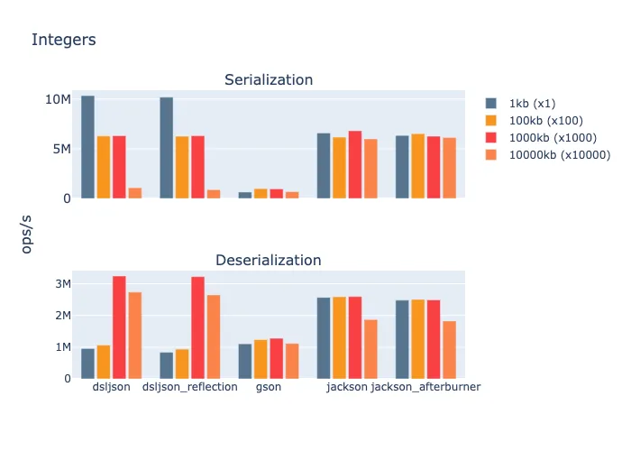
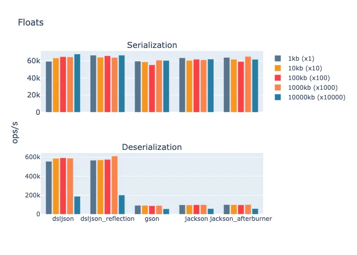
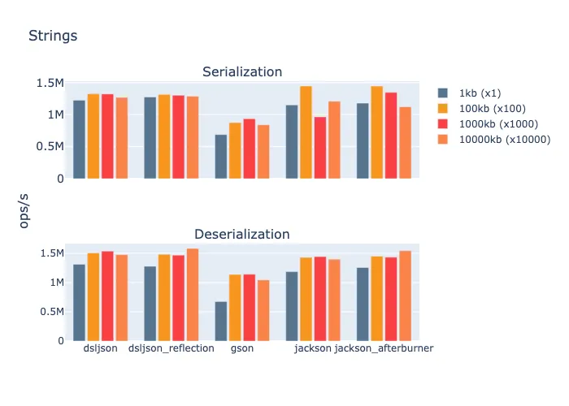

# Benchmarking JSON Parser for Java

This project aims to survey the performance of Java JSON parsers for each type specified in JSON 
specification using payloads of different sizes.

## Parsers

| Library | Version |
|:------|:------|
|jackson|2.13.1| 
|gson|2.8.9|
|dsl-json|1.9.9| 
|jsoniter|0.9.23|

## Results

