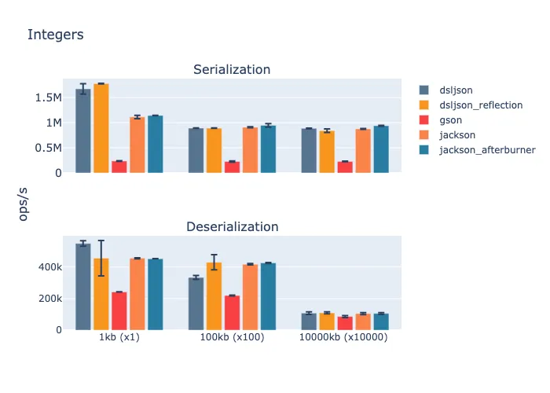
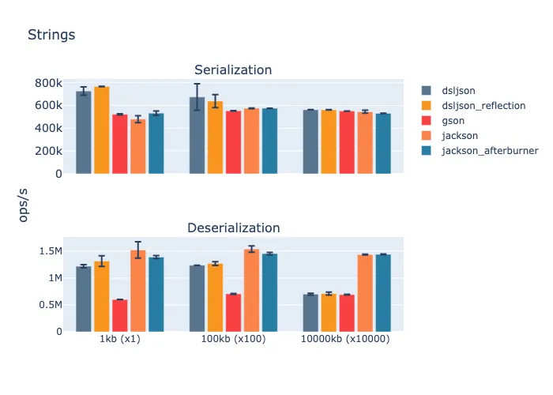
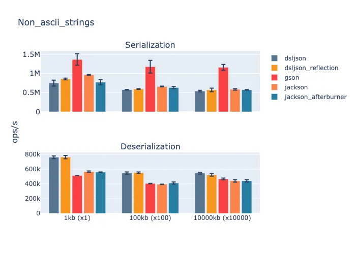

# Benchmarking JSON Libraries for Java

This project aims to survey the performance of Java JSON parsers. Benchmarks are written to 
test each data type individually using payloads of different sizes. Benchmarked types are:

- numbers - integers and floats
- strings - ASCII and non-ASCII strings
- booleans

Libraries used in the last set of benchmarks:

| Library | Version |
|:------|:------|
|jackson|2.13.1| 
|gson|2.8.9|
|dsl-json|1.9.9| 

### Benchmark Environment

A Linode(4 CPUs, 8GB RAM) on Debian 11 was used for benchmarking. 

JMH info:

```
# JMH version: 1.34
# VM version: JDK 11.0.14, OpenJDK 64-Bit Server VM, 11.0.14+9-post-Debian-1deb11u1
# VM invoker: /usr/lib/jvm/java-11-openjdk-amd64/bin/java
# VM options: -XX:+AggressiveOpts -Xms2g -Xmx2g
# Blackhole mode: full + dont-inline hint (auto-detected, use -Djmh.blackhole.autoDetect=false to disable)
# Warmup: 5 iterations, 10 s each
# Measurement: 10 iterations, 3 s each
# Timeout: 10 min per iteration
# Threads: 16 threads, will synchronize iterations
# Benchmark mode: Throughput, ops/time
```

## Running

- `mvn package` - build and create a JAR
- `./bench` - run individual benchmarks using selected payload sizes and libraries. Usage:
  ```
    usage: bench [ -f <forks> ] [ -i <measurementIterations> ]
      [ -m <measurementTime> ] [ -t <threads> ] [ -wi <warmupIterations> ]
      <command> [ <args> ]
    
    Commands are:
    deser   Runs the deserialization benchmarks
    help    Display help information
    info
    ser     Runs the serialization benchmarks
    
    See 'bench help <command>' for more information on a specific command.
  ```
- `./bench-output` - run benchmarks using the parameters provided in the script and publish the 
  results to the `output` directory
- `./scripts/parse_output.py` - process the results in the `out` directory and export as CSV 
  files to `./output/csv` to make it ready for chart creation
- `python3 scripts/graph.py` - create charts out of files in `./output/csv`
  - Be aware of Python packages needed to run this script

## Results







## Notes

Best effort has been put forward to keep the project similar to its 
[original fork](https://github.com/fabienrenaud/java-json-benchmark) in order to streamline the 
process of adding new libraries and benchmarks.
