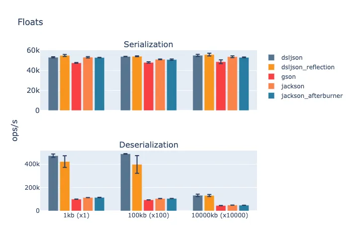
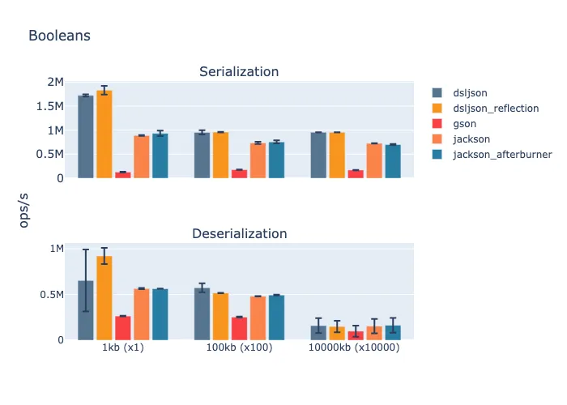
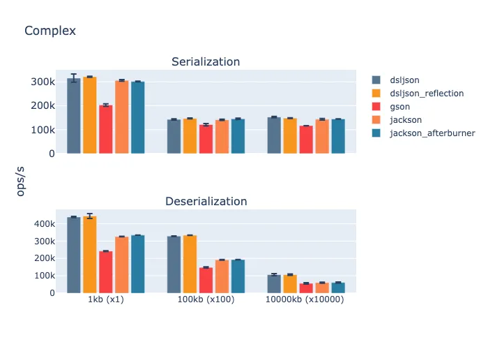

# Benchmarking JSON Libraries for Java

This project aims to survey the performance of Java JSON parsers. Benchmarks are written to 
test each data type individually using (randomly generated) payloads of different sizes. Benchmarked types are:

- numbers - integers and floats
- strings - ASCII and non-ASCII strings
- booleans
- complex - heavily nested data consist of above data types

Libraries used in the last set of benchmarks:

| Library | Version |
|:------|:------|
|jackson|2.13.1| 
|gson|2.8.9|
|dsl-json|1.9.9| 

### Benchmark Environment

```
Model: Dell XPS 13
Processor Name: i7-8565U
Number of Physical Cores: 4 (HT disabled)
Memory: 16 GB
Frequency: 1.7 GHz (dynamic scaling disabled)
```

JMH info:

```
# JMH version: 1.34
# VM version: JDK 1.8.0_292, OpenJDK 64-Bit Server VM, 25.292-b10
# VM invoker: /usr/lib/jvm/adoptopenjdk-8-hotspot-amd64/jre/bin/java
# VM options: -Xms2g -Xmx5g
# Blackhole mode: full + dont-inline hint (auto-detected, use -Djmh.blackhole.autoDetect=false to disable)
# Warmup: 8 iterations, 15 s each
# Measurement: 10 iterations, 3 s each
# Timeout: 10 min per iteration
# Threads: 4 threads, will synchronize iterations
# Benchmark mode: Throughput, ops/time
```

## Running

- `mvn package` - build and create a JAR
- `./bench` - run individual benchmarks using selected payload sizes and libraries. Usage:
  ```
  usage: bench [ -f <forks> ] [ -i <measurementIterations> ]
  [ -m <measurementTime> ] [ -t <threads> ] [ -wi <warmupIterations> ]
  [ -wt <warmupTime> ] <command> [ <args> ]
  
  Commands are:
  deser   Runs the deserialization benchmarks
  help    Display help information
  info
  ser     Runs the serialization benchmarks
  
  See 'bench help <command>' for more information on a specific command.
  ```
- `./bench-output` - run benchmarks using the parameters provided in the script and publish the 
  results to the `output` directory
- `python3 scripts/parse_output.py` - process the results in the `out` directory and export as CSV 
  files to `./output/csv` to make it ready for chart creation
- `python3 scripts/chart.py` - create charts out of files in `./output/csv`
  - Be aware of Python packages needed to run this script
  - Setting`SET_SIZES_AS_X` variable to `True` sets the sizes of benchmark payload as the X axis  

## Results








## Notes

- Best effort has been put forward to keep the project similar to its 
[original fork](https://github.com/fabienrenaud/java-json-benchmark) in order to streamline the 
process of adding new libraries and benchmarks.

- This [issue](https://github.com/scala/scala-dev/issues/338) has been used for prepping benchmarking environment.
